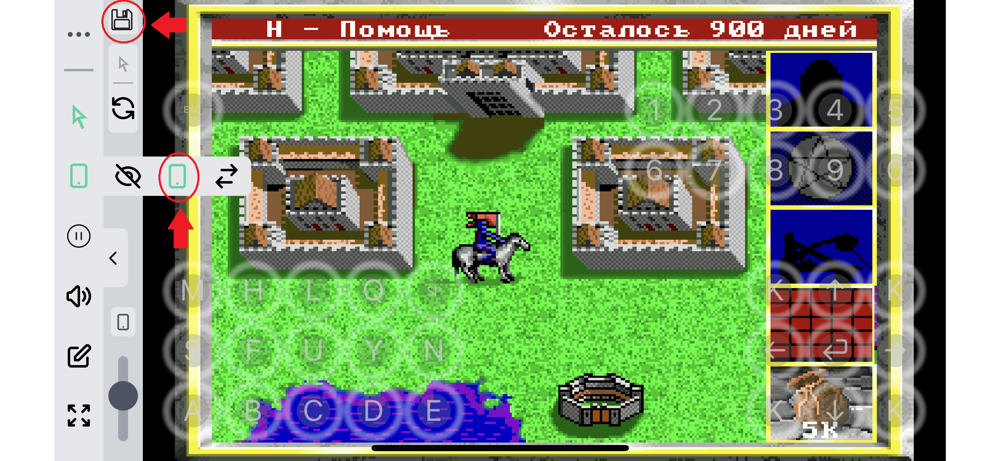

# 2000_DOS_remake_kings_bounty_game
Remake of the old ms-dos game king's bounty made on borland pascal 7.0

The game was written for the MS-DOS platform in Borland Pascal 7.0. The graphics mode is VGA with a resolution of 320x200 and 256 colors. To work with sprites, own libraries have been written, based on direct recording to the video memory. Graphical assets are obtained from RAM dumps of the original game.

*Read this in other languages: [English](README.md), [Русский](README.ru.md)

There are some screenshots if a gameplay:

# Table of contents
- [Installation](#Installation)
- [Brief description of the game](#Brief-description-of-the-game)
    - [The story](#The-story)
    - [Game goal](#Game-goal)
    - [Start of the game](#Start-of-the-game)
    - [Travel Spells](#Travel-Spells)
    - [Combat Spells](#Combat-Spells)
- [Play in browser](#Play-in-browser)

# Installation

To start the game, just download the game.zip file, unpack the archive and run knight.exe, preferably in the DosBox emulator.

Also you can play online in the browser through the js-dos emulator [Play in browser](#Play-in-browser)

To compile from sources (code folder), you have to use the Borland Pascal 7.0 compiler

# Brief description of the game

## The story

Spurred on by the Demon, seventeen villains stole the King Maximus Scepter and hid it in an unknown place. Demon gave
King Maximus some time to find the Scepter and the enchanted map of the place where the Scepter was buried, since he was sure that the Scepter would never
will be found. King Maximus has summoned you to his palace and instructed you to find the Scepter.

## Game goal

The goal of the game is to find the Scepter. The scepter is buried in an unknown place, but you have
map of the area where the Scepter is buried. Since the card is enchanted its cells
closed. You can open the cells of the map either by capturing the villains, or by finding
artifacts, of which there are two on each of the four continents. To take prisoner
the villain must first conclude a contract for him in the city, and then take the castle
in which it is located.

## Start of the game

Immediately after starting the game, you will can chose between four heroes (A-D) for
one of which you can start a new game or (L) restore the saved game. At the beginning of the game you are on the first continent called
Continentia near the palace of King Maximus and the city. In the upper right corner
shows the number of days in which you must find the Scepter. In the King's palace you can:

1) Talk to the King
2) Recruit soldiers for the army

    The King will give you a task that you must complete to get the next
ranks. At the beginning of the game, you cannot purchase cavalry and knights because
your rank is not enough for this. The ability to buy the units depends
on the amount of your money and from your leadership. There are 25 different types of units in the game. In the King's Palace you can
purchase only 5 different types of units, other types of units can be purchased
in camps that look like wagons, trees, caves and cages. However
this is inconvenient in that the number of warriors in these camps is limited.
In any city you can:

1) Sign a contract for a villain
2) Rent a ship
3) Buy a catapult
4) Find out information about the nearest castle and its owner
5) Buy a spell

At the beginning of the game, you can to sign a contract to capture only the five most
weak villains, but as you capture the villains their list
will expand. When signing a contract, you will find out the continent and the castle where
the villain lives if you went there before. If you take the castle with the villain without signing the contract previously, then the villain
move to another castle. If you rent a boat, you can sail on it by water, but you will have to pay 500 gold per week for this and more
500 upon purchase. A catapult is needed when capturing a castle in order to break through the wall. In the city, you can buy one of 14 spells:

## Camping Spells

  1) Bridge (Sets a bridge with a length of Magic Power)
  2) Stop Time (Stops time for a certain number of steps)
  3) Leadership (Increases leadership until the end of the week)
  4) Teleport Castle (Teleports to any of the previously opened castles)
  5) Teleport City (Teleports to any of the previously opened cities)
  6) Additional Army (Gives a random unit)
  7) Find the Villain (Reports full information about the villain)

## Combat spells

  8) Add Army (Increases the number of the marked type of unit)
  9) Teleport (Teleports the unit to any place on the battle map)
10) Fireball (Impact Spell)
11) Lightning (Impact Spell)
12) Freeze (A frozen unit loses one turn)
13) Resurrection (Increases the number of the unit to the initial value)
14) Strike on the Dead (Strike spell only works on the dead)

Note: Magic does not work on dragons.

To travel between the continents you need a map of the following
continent. You can find it in a chest on any continent except the last one.
There is only one map per continent. In the rest chests you can make a choice between:

   1) Get yourself some money.
   2) Give it to the peasants and thereby increase your leadership by X

When you walk around the map, you sometimes come across roaming enemes, which, like
as soon as they see you, they start chasing you until they call you to
the battle. If you lose, you will be returned to the King, otherwise you will receive
reward for the units you killed. If you capture the castle and leave a garrison in it
then the castle will bring you a weekly income of 1000 gold. If you have in your army only flying units except spirits then you can fly (F key).

# Play in browser

Using the link below, you can try the game in the browser, through the js-dos emulator

[Play](https://andrey-andrianov.github.io/sites/jsdos/knight.html)

For more convenient control from mobile devices, the most frequently used keys have been added to the screen. They can be hidden or shown from the DosBox control panel on the left.

To save the game, you must first save the game by pressing the q key, and then save the current state of DosBox by pressing the floppy disk icon in the upper left corner. The current state is stored in the browser's Local Storage. Also, for playing on mobile devices, it is convenient to add a web page to the home screen of the device.
