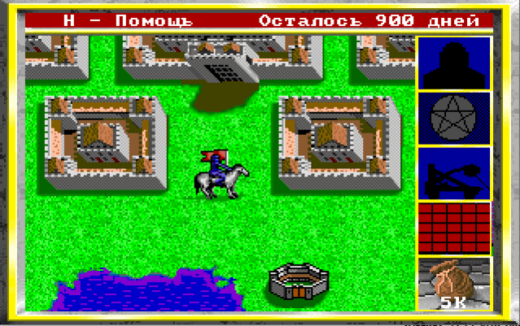

# 2000_DOS_remake_kings_bounty_game
Remake of the old ms-dos game king's bounty made on borland pascal 7.0

As a child, I liked the game King's Bounty from New Computing. In my school years, when I was learning programming, I wanted to write my own version of this game with minimal changes, but in Russian. And somewhere around the year 2000, I realized my plan.

The game was written for the MS-DOS platform in Borland Pascal 7.0. The graphics mode is VGA with a resolution of 320x200 and 256 colors. To work with sprites, own libraries have been written, based on direct recording to video memory.

*Read this in other languages: [English](README.md), [Русский](README.ru.md)

There are some screenshots if a gameplay:

